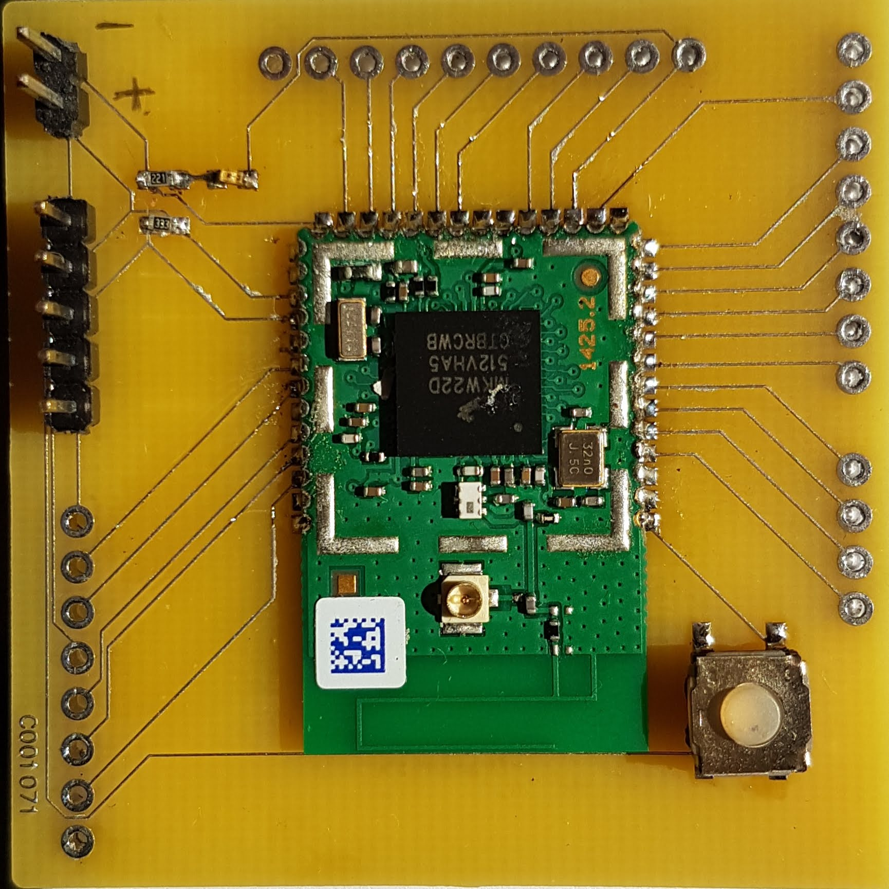
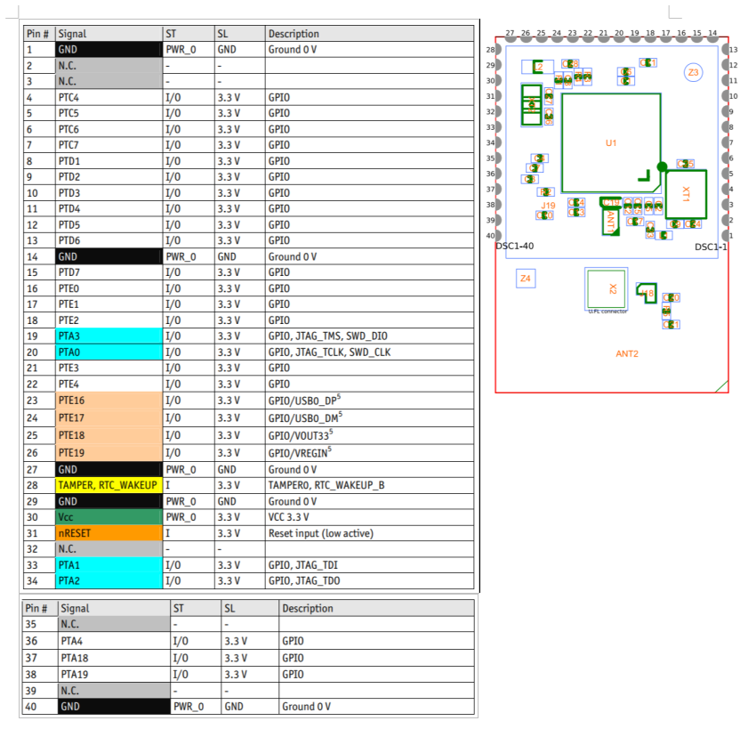

# List of components

  - Phytec Phywave KW2xD module
  - Micro switch 
  - Led (Red)
  - Pin headers
  - Resistors
 
# Board Revisions

v1.0: Initial version. 

# Next steps

- Add specific JTAG header
- Increase track interspace
- Add power-on led
- Replace reset switch with a smaler one
- Reduce board size 

