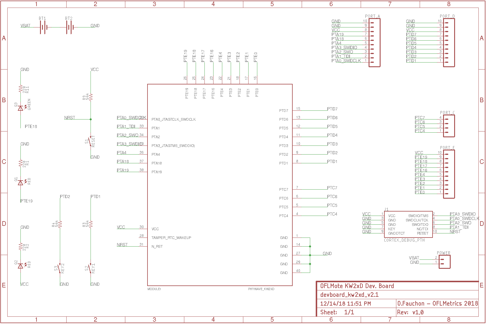
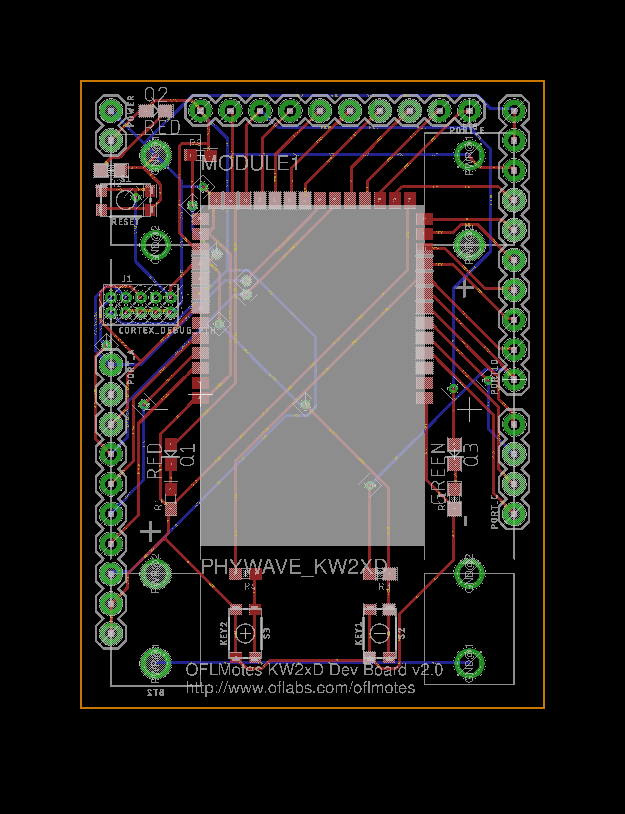
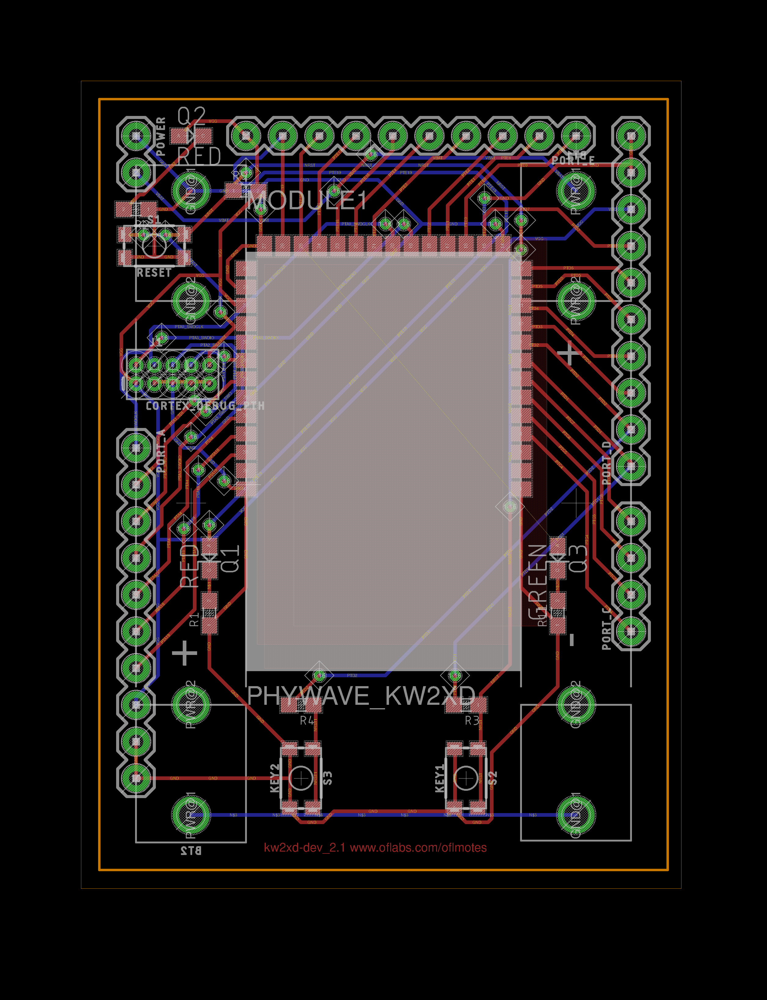

v2.0

  - New design with more led, buttons, AAA Batteries

Manufactured batch of 5 boards on nov 2018.

v2.1 (Work in progress) 

  - Add Restrict / Keepouts areas on Phynode module
  - Don't use  PTE18/PTE19 for LED1/2 as it can't be used as  GPIO :-(  
  - Top Left 2 pin headers can be used to switch on/off or for current measurement

