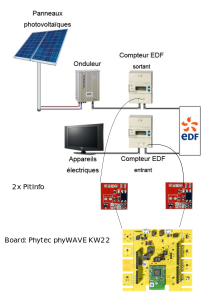

# Dual Teleinfo Power Meter monitoring

1. Components

  - Board: Phytec phyWAVE KW22
  - Teleinfo interface : Hallard PitInfo

1. Teleinfo protocol

Data format: 1200 baud / 7 bit data / 1 bit stop / Parity

Example: 

    MOTDETAT 000000 B
    ADCO 031028256512 :
    OPTARIF BASE 0
    ISOUSC 30 9
    BASE 014036028 #
    PTEC TH.. $
    IINST 010 X
    IMAX 037 I
    PAPP 02340 *
`

    => ADCO   => Meter ID
    => IINST  => Current Intensity (Amp)
    => ISOUSC => Max intensity (contract / Amp)
    => BASE   => Total consumed  (Wh)
    => PAAP   => Apparent power
    => PTEC   => Billing period

## References: 

Phywave KW2X:
https://github.com/RIOT-OS/RIOT/wiki/Board%3A-Phytec-phyWAVE-KW22

Linky protocol:
https://www.yadnet.com/domotique/protocole-teleinfo-du-compteur-linky/

Pitinfo interface board:
https://www.tindie.com/products/Hallard/pitinfo/
https://github.com/hallard/teleinfo/tree/master/PiTInfo

